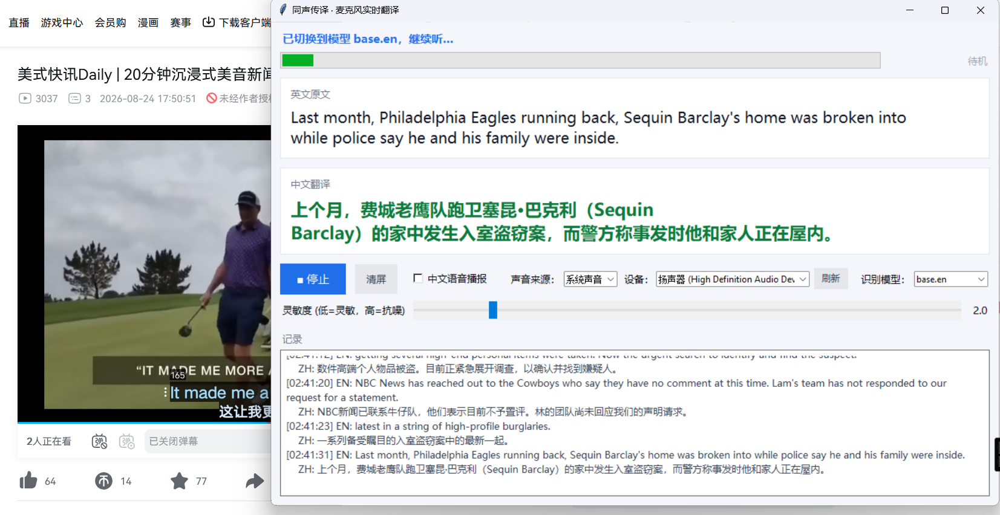
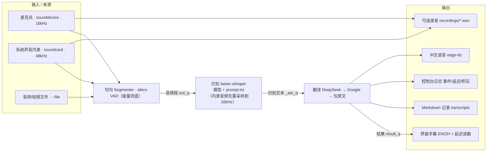

# live-interpreter

A lightweight, real-time **English → Chinese** interpreter that runs on your own
computer's microphone. It listens to speech, transcribes it locally, translates
it into Chinese, and can read the translation aloud — while saving the whole
session to a Markdown file so you can review it later.

> **Status: actively maintained & under development.**
> This project is being improved continuously. Features, behavior, and the CLI
> may change between versions. Feedback and bug reports are welcome.

## Preview



## Why this project

The original motivation was being unable to follow an English-language lecture in
real time. This tool is designed to **help you study English course materials —
recorded lectures, audio, or video files — instead of relying only on a live
classroom where you either miss the flow or fall behind.**

Give it a recording or a lecture audio, and it produces **bilingual
English/Chinese subtitles** you can read and keep. For live use, you can also
point it at your microphone to get near-real-time captions and (optionally)
spoken Chinese.

## Pipeline

```
Microphone / audio file
  → English transcription (faster-whisper, offline)
  → Chinese translation (DeepSeek, or a free fallback)
  → on-screen captions + optional spoken Chinese (edge-tts)
  → Markdown transcript
```

## Architecture



## Features

- **Local, offline speech recognition** — the Whisper model is cached on your
  machine, so the ASR step works without internet.
- **Reliable speech segmentation with silero VAD** — ignores background noise
  and only splits on real speech (this was key to making it work with a hot mic).
- **Live microphone mode** — a GUI with on-screen bilingual captions, a live
  input level meter, and an optional Chinese voice.
- **System-audio (loopback) mode** — capture what the computer is playing (e.g.,
  an online lecture or a video) directly, using Windows WASAPI loopback, instead
  of relying on a physical microphone.
- **Offline file mode** — transcribe and translate an audio/video file, then save
  a full Markdown transcript.
- **Pluggable translation** — DeepSeek by default (auto-read from your local
  config or `.env`), with a Google Translate free fallback, and "original only"
  as a last resort.
- **Automatic Markdown logs** — every live session appends timestamped
  EN/ZH lines to `transcripts/tongchuan_YYYYMMDD_HHMMSS.md`.
- **Live model switching** — change the ASR model at runtime via the **识别模型**
  dropdown (no restart needed; larger models pause briefly while loading).
- **Record the lecture audio** — while watching on the **system sound** source,
  optionally save what's playing to `recordings\*.wav`, so you can translate it
  reliably later even when the platform can't be downloaded (e.g. WebLecture).
- **Diagnostic console log & latency meter** — the launcher window prints a
  timestamped event log plus a per-utterance latency/backlog and a 5-second
  backlog heartbeat; the GUI shows a live **延迟 X.Xs** readout.
- **Easy setup** — a one-click installer and a launcher for Windows.

## Requirements

- Windows (developed on Windows 10/11, Chinese locale)
- Python 3.10+ (3.13 tested)
- Internet for the translation and voice steps (ASR itself works offline)
- A working microphone, and **internet** if you want the spoken Chinese output

## Quick start (Windows)

1. **Install once:**

   ```bat
   安装同声传译.bat
   ```

2. **Run the app:**

   ```bat
   启动同声传译.bat
   ```

3. Pick your microphone, press **Start**, and speak. The English and Chinese
   captions appear on screen, and a Markdown file is written to `transcripts\`.

> The first start downloads the Whisper model (about 10–20 seconds); it is cached
> afterwards.

## Usage

### GUI (default)

```bat
.venv\Scripts\python.exe tongchuan.py
```

### Console mode

```bat
.venv\Scripts\python.exe tongchuan.py --console
```

### Capture the computer's own audio (system sound / loopback)

To translate audio that is *playing on your computer* — an online recorded
lecture, a video, or a browser stream — switch the source to **system** instead of
the microphone. In the GUI, choose **声音来源 → 系统声音** and pick the speaker
device to monitor. From the CLI:

```bat
.venv\Scripts\python.exe tongchuan.py --source system --console
```

This uses Windows **WASAPI loopback** (via `soundcard`) and resamples the captured
audio (typically 48 kHz) down to 16 kHz for Whisper.

> **Loopback is the least reliable source.** If you see a flood of
> `data discontinuity in recording` warnings, or get only the **first** sentence
> translated and then the meter stays on “待机” (standby), the loopback stream is
> delivering broken or noisy audio — the speech detector no longer finds clear
> speech, so subsequent sentences are skipped (or Whisper hallucinates junk).
> Suppressed those benign warnings; for accuracy, use the audio-file or microphone
> modes below.

### Which source should I use?

- **Microphone** — live, ambient speech (your own voice, or the room). Reliable.
- **Audio file** — the **recommended** way to study a recorded lecture / video:
  translate the whole file at once with no real-time constraints.
- **System sound (loopback)** — what the PC is playing. Convenient, but the least
  stable; prefer it only when you can't obtain the audio as a file.

### Can't download the lecture? Record the audio instead

If the course platform doesn't let you download the video/audio (e.g. NUS
WebLecture), you can still get an accurate transcript:

1. Pick **声音来源 → 系统声音**, tick **“录制音频存文件”**, press **开始**, and let
   the lecture play. The app writes the audio to `recordings\*.wav` (16 kHz mono)
   while it tries live captions (which may be unreliable).
2. When the lecture ends, press **停止** (the WAV is saved), then translate the
   recording reliably:

   ```bat
   .venv\Scripts\python.exe tongchuan.py --file "recordings\同传录音_....wav" --save --model large-v3-turbo
   ```

Recordings are stored in `recordings\` and are **gitignored** (never pushed).

### Translate an audio/video file

This is the recommended way to study English learning materials:

```bat
.venv\Scripts\python.exe tongchuan.py --file "lecture.mp3" --save
```

The results are printed to the console and, with `--save`, written to
`transcripts\` as a Markdown file.

### Useful options

```text
--model base.en|small.en|medium.en|large-v3-turbo|large-v3
                                    Whisper model (default: small.en)
--voice / --no-voice                 Enable / disable spoken Chinese
--source mic|system                  Input source (microphone or system audio)
--sensitivity N                      Mic sensitivity (1–8, default 3)
--list-devices                       List available microphones
--test-mic                           Self-test each microphone's level
--save                               (with --file) save a Markdown transcript
--save-audio                         Record the captured audio to recordings\*.wav
```

The GUI now has a **“识别模型” model dropdown** so you can switch the ASR model and
compare results interactively (default is `small.en`; larger models are more
accurate but slower).

### Live model switching & console logs

- **Model switching is live.** Changing the **“识别模型” dropdown while running**
  takes effect at the next idle moment (the app reloads that model; larger models
  pause briefly while loading). If the app is not running, the choice applies to
  the next start.
- **Console log:** the black terminal window opened by `启动同声传译.bat` prints a
  timestamped event log — model load/ready/switch, recognition text, translation
  backend and latency, and every UI action (start/stop, source/device/model change,
  sensitivity, voice toggle, clear). Use this to see what the app is doing in real
  time. It also prints a **backlog heartbeat** every 5 s (`待翻译`/`待识别`/`结果队列`)
  and the per-utterance latency+queue size, so you can tell whether the pipeline is
  falling behind (e.g. a growing `待翻译` count means translation is the bottleneck).

- **Latency & responsiveness.** The GUI shows the **measured end-to-end latency** of
  the latest translation (`延迟 X.Xs`). Latency = segment-accumulation (up to the
  **分段上限**, default 10 s) + recognition + translation. Use the **分段上限**
  dropdown to trade speed vs. completeness: a smaller value (e.g. 4 s) responds
  faster but can cut phrases; a larger value is more complete but adds delay.

  Measured on this machine for a ~9 s utterance:

  | Model | Load | ASR time | vs. live |
  |---|---|---|---|
  | base.en | ~5 s | ~5 s | ≈0.6× (keeps up) |
  | small.en | ~5 s | ~17 s | ≈1.9× (lags) |
  | medium.en | ~17 s | ~44 s | ≈4.8× (file mode only) |
  | large-v3-turbo | ~14 s | ~43 s | ≈4.6× (file mode only) |

  So large models are best for **file mode**, not live captions.

For more accurate technical terminology, use `--model small.en`:

```bat
.venv\Scripts\python.exe tongchuan.py --model small.en
```

### Better accuracy for ECE / technical content

If you study **Electronic & Computer Engineering** materials, two settings help a lot:

1. **Use a larger Whisper model.** `base.en` is fast but can fumble technical
   words. `small.en` is a big step up, and `medium.en` is even better (slower on
   CPU):

   ```bat
   .venv\Scripts\python.exe tongchuan.py --model small.en
   ```

   > **Accented English (e.g. Indian/Punjabi accents):** small models can struggle
   > with heavily accented speech. For the best accuracy on such lectures, use
   > `large-v3-turbo` with **file mode** (`--file lecture.mp3 --save`), where there
   > is no real-time limit. On CPU the large model is much slower, so it's meant for
   > recordings rather than live captions.

2. **Domain-aware prompts.** The speech recognizer feeds a curated vocabulary to
   Whisper as an `initial_prompt`, and the translator uses a domain-specific system
   prompt that keeps English terms with a Chinese gloss (e.g., 卷积（convolution）,
   缓存一致性协议（cache coherence protocol）). The built-in vocabulary covers
   signal processing, control & ML, computer architecture and hardware optimization,
   caches and memory hierarchy, parallel & distributed computing, and computer
   networks. To tune this per course, edit `prompt.txt` in the project folder — it
   is read at runtime and is **gitignored**, so your personal additions are never
   pushed. Translation behavior can be adjusted in `translation.py`
   (`ECE_SYSTEM_PROMPT`).

3. **What "Sensitivity" really does.** The Sensitivity slider only controls how
   eagerly audio is treated as speech (low = more sensitive, high = more robust
   against background noise). It does **not** affect translation quality. For more
    accurate output, prefer a larger model and the domain prompt above. Translation
    is already instructed to be faithful and complete (keep every detail, no
    summarizing) and runs at temperature 0 for consistent results.

For ASR mishaps, the translator also infers the intended words from context and
phonetic similarity (e.g. `messy` → `MESI`, `Barclay` → `Barkley`) and translates
the corrected meaning, so common speech-recognition errors don't leak into the
Chinese output.

## Courseware glossary (better alignment)

Feed a course's Markdown (`--course docs\sample-courseware.md`, or pick it from the
GUI **课程课件** dropdown) and the app extracts a **glossary** that:

1. adds the course's terms to the ASR prompt (`prompt.txt`), so technical terms are
   more likely recognized — and homophones get corrected (e.g. `MESI`, not `messy`);
2. injects a **translation glossary** (`term = 标准中文`) so the Chinese output uses
   the same wording as your handout.

See [docs/sample-courseware.md](docs/sample-courseware.md) for the expected format
(front-matter + a `## 术语表` table + sectioned body). Put your own courses in
`courseware\` (gitignored).

```bat
.venv\Scripts\python.exe tongchuan.py --course docs\sample-courseware.md
```

### Convert PDF/PPT to courseware Markdown

If you have the slides as PDF/PPTX, convert them first:

```bat
.venv\Scripts\python.exe convert_courseware.py "slides.pdf" --course "计算机组成原理"
```

It writes `courseware\<课程名>.md`, split into per-page sections and (with a DeepSeek
key) auto-fills a `## 术语表` for acronyms. Edit it to add lowercase technical
phrases (e.g. `store buffer`, `cache coherence`) that the auto-extract misses.

Measured effect on `base.en` (sample hardware/memory sentence):

| | Without courseware | With courseware |
|---|---|---|
| ASR key terms | 10/11 (`MESI`→`messy`) | 11/11 (`MESI`) |
| Translation terms | 存储缓冲区 / 内存排序 / MESI | 存储缓冲 / 内存序 / 缓存一致性协议(MESI) |

The ASR gain is modest on clean audio but larger on real/noisy/accented lectures;
the translation glossary reliably aligns the wording with your handout.

## Translation backend & API key

Translation uses **DeepSeek** (an OpenAI-compatible endpoint) by default. The API
key is **never stored in this repository**. It is read in this order:

1. Environment variable `DEEPSEEK_API_KEY` or `OPENAI_API_KEY`
2. The local `~/.codex/config.toml` file's `experimental_bearer_token` (a
   convenience for this author's machine)
3. A `.env` file in the project directory (`DEEPSEEK_API_KEY=sk-xxxx`) — this is
   the portable, documented way

If no key is available (or DeepSeek is unreachable), it falls back to a free
Google Translate endpoint, and finally shows the original English only.

To change the model or endpoint, edit `translation.py`.

## Privacy

- Microphone/audio is processed **locally** for recognition and is never
  uploaded.
- Only the **recognized English text** is sent to DeepSeek for translation, under
  your own account.
- Spoken output uses Microsoft's `edge-tts` service.

## Troubleshooting

- **"Cannot open microphone":** check Windows **Settings → Privacy → Microphone**,
  or try a different device from the dropdown.
- **Captions never appear:** the level meter near the top is the first thing to
  check. If it barely moves, the microphone isn't capturing audio. If it is high
  but nothing is transcribed, the background noise is being mistaken for speech —
  raise **Sensitivity**, or run `--test-mic` and pick a device with a sane level.
- **No spoken Chinese:** confirm the system output device works and that voice is
  enabled.
- **First use shows `symlinks` and `unauthenticated requests to HF Hub` warnings:**
  these are benign — the model is downloading/caching on first use; the symlinks
  note is just how `huggingface_hub` caches on Windows. It is suppressed by default
  in the launchers (`HF_HUB_DISABLE_SYMLINKS_WARNING=1`); you can also set that env
  var yourself.
- **Only the first sentence is translated, then nothing (meter stays “待机”):**
  this is usually a *source* reliability problem, not a bug in the pipeline. The
  app translates speech continuously when it receives clean audio. If you are on
  the **system sound (loopback)** source, the WASAPI loopback stream may be
  dropping/breaking audio after the first sentence (look for
  `data discontinuity in recording`). Switch to **audio-file** mode
  (`--file lecture.mp3 --save`) or the **microphone** for reliable results; if you
  must use loopback, pick the output device that is actually playing audio.
- **Reinstall / move to another machine:** run `安装同声传译.bat` (needs internet;
  it creates the environment, installs dependencies, and downloads the model).

## Roadmap / TODO

Planned improvements (ideas only — not implemented yet). Feedback and PRs welcome.

- [ ] **Courseware-aligned recognition & translation** — use your local PPT/PDF course
  material to improve alignment between the speech translation and the slides:
  - [x] Phase 1 · **Glossary extraction** *(highest value, lowest effort)* — parse a
    course **Markdown**, extract the key terms / acronyms / proper nouns, and
    generate (a) an ASR term list (`prompt.txt`) and (b) a translation glossary
    (`term = 标准中文`) that are injected automatically.
  - Phase 2 · **Context retrieval** — index each slide's text; when a sentence is
    recognized, retrieve the most relevant slide and include it as translation
    context so the wording matches the current topic.
  - Phase 3 · **Slide mapping** — tag each translated line with the likely
    slide/page number and timestamp in the transcript for easy review.
- [ ] **Lower live latency** — parallelize translation, or make the segment length
  (分段上限) adaptive to speech rate (faster speech → shorter segments).
- [ ] **More robust system-audio (loopback) capture** — better device auto-selection and
  a clearer on-screen hint when no speech is detected.
- [ ] **Instant model switch** — preload the selected model in the background so
  changing the ASR model is seamless.

## License

MIT — see [LICENSE](LICENSE).

---

## 中文简介

一个在你电脑上跑的**实时英→中同声传译**小工具：用麦克风听写英文，本地离线识别，
翻译为中文，可中文语音朗读，并自动保存为 Markdown。**最适合拿英语学习资料（录音、
视频、音频）来做双语字幕学习**，而不是只能靠现场课堂硬跟。核心依赖：`faster-whisper`
（离线识别）、`DeepSeek`（翻译，key 不写进仓库）、`edge-tts`（中文语音）。

> 本项目**仍在维护和改进中**，功能与命令可能随版本变化，欢迎反馈。

```
双击 安装同声传译.bat   # 首次安装（需联网）
双击 启动同声传译.bat   # 启动界面
```

**来源选择建议**：学录播/视频**优先用文件模式** `--file 讲座.mp3 --save`（整段稳定翻译成双语稿）；现场实时用**麦克风**最稳；「系统声音(内录)」最方便但**最不稳定**——若只翻出第一句、或一直显示“待机”，多半是内录把音频抓成了断续/噪声，请改用文件或麦克风。

> 规划中的改进（课件对齐识别/翻译、降低延迟等）见上方 “Roadmap / TODO”。

更详细的中文使用说明可查看历史版本或提交 issue。
