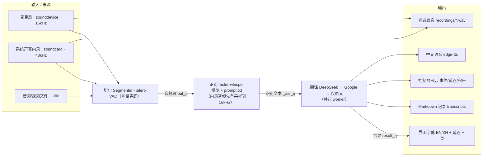

# Architecture

The app is a multi-threaded pipeline: capture → segment → transcribe → translate →
present.

## Threading & queues

- **GUI thread** owns the tkinter window and drains `result_q` (every 120 ms).
- **Capture** feeds the Segmenter via a background thread (system loopback) or the
  sounddevice callback (microphone).
- **Segmenter thread** runs silero VAD and emits audio segments (`out_q`).
- **ASR thread** transcribes segments (`_asr_q`) with the courseware prompt.
- **Translation** runs on a small worker pool (default 2) with **ordered output** into
  `result_q`; the coordinator also prints a periodic backlog heartbeat.
- **TTS thread** synthesizes + plays the latest translation (drops stale audio).

Add-on tasks: WAV recording (from capture), Markdown/console logging, courseware
glossary and context retrieval (see [COURSEWARE.md](COURSEWARE.md)).
